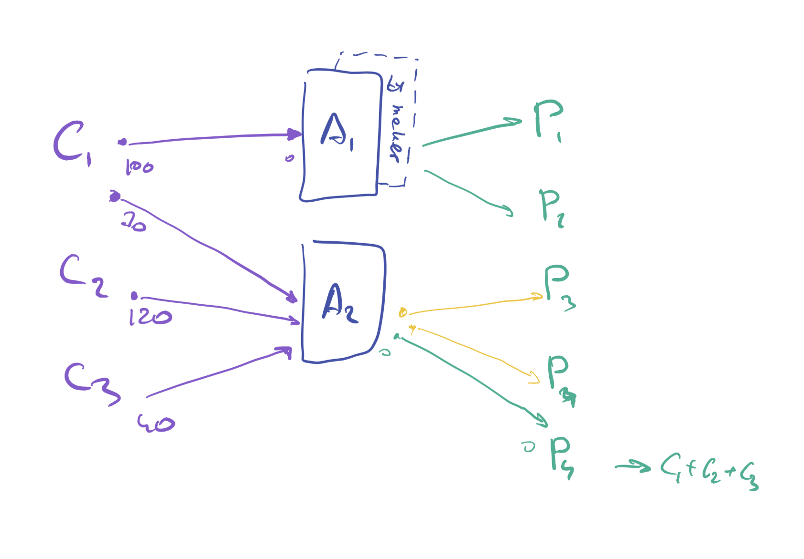

Accountant pattern
==================

Initial ideas of using uni-directional payment channels has two main problems: double spend and relativelly big amount of settlements into blockchain.

### Double-spending problem

Traditional payment channels (one-to-one) are not suitable for our needs because of couple problems:

1. They need to open channel with any provider (even if consumer is getting only couple of minutes of service), which leads into a lot of main net transactions.
2. They require locking tokens in each channel. To get them back and move into new channel, would mean doing mainnet transaction.

Solution to these problems is Lightning Network. However it works only on Bitcoin. Raiden Network, which aim to implement same capabilities as Lightning Network but for ERC20 tokens, is still not prodaction/mainnet ready, requires using their own token and don't have traction in Ethereum community.

Another solution is having one-to-many one directional channels. In this case consumers can topup some amount of tokens into single smart-contract. Later he could sign `promises` (cryptografical digital cheques) for different providers. With such `promises` provider can ask the smart-contract to transfer given amount of tokens into given destination. The problem of this solution is double-spending possibility. Consumer can issue `promises` for bigger amount than is locked in his smart-contract. This motivates providers to settle promises more often (to avoid loosing bigger amount of funds), which leads to bigger spendings on mainnet fees.

### Ineficiency in settlement of cheques (promises)

We do expect that there will be much more consumers that providers. In the same time there is big chance, that once consumer will use services of particular provider only couple of times a week. This leads provider to having big amount of unsettled promised issued by different consumers. Significant amount of promises can have quite small amounts (less that 1 USD worth MYST tokens). This means, that provider either will have to spend quite big part of his earnings on settling promises into ethereum blockchain, either to wait unpredictably long time untill consumers will return and will pay him more.

Proposed solution
-----------------

Getting inspiration from Lightning Network and introducing `Accountant` role (hub which has opened channels with many consumers and many providers) can help to significantly reduce both of higher described problems.

There may be a few accountants deployed in the network and each node can work with multiple accountants.

