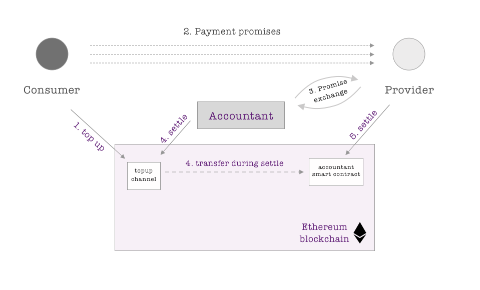

Main smart contracts
====================

Registry smart contract
-----------------------

[`contracts/Registry.sol`](../contracts/Registry.sol) - will register new identities, charge registration fee and will deploy channel smart contract for given identity.

Main functions of Registry:

#### Register identity
`registerIdentity` function is registering new identity and requires such attributes:
 * `_accountantId`: accountant's smart contract address
 * `_loanAmount`: amount of tokens (in wei) to stake, needed only if user is willing to open provider type (receiving) channel.
 * `_fee`: amount of tokens (in wei) which will be send back for `msg.sender` (usually transaction making service). Can be set to 0 if user is doing transactions by himself.
 * `_beneficiary`: address of beneficiary who will receive tokens after settlement in receiving/provider channel. By default can be set as topup channel address.
 * `_signature`: signature of registering identity which is signing such parameters: registryAddress + _accountantId + _loanAmount + _fee + _beneficiary.

#### Register accountant
`registerAccountant` function (in payload 0xf4c1a1f6) is registering new accountant and requires such attributes:
 * `_accountantOperator`: address of account which will operate accountant smart contract and sign all off-chain messages on his behalf.
 * `_stakeAmount`: amount of tokens (in wei) to be staked by accountant as security deposit.

#### Get channel address
`getChannelAddress` function gets `identityHash` (hash of identity's public key) and `accountantId` as parametera and returns its topup channel address.

#### Get accountant address (a.k.a. accountantId)
`getAccountantAddress` function gets accountant operator address as parameter and returns address of its smart contract

#### Check if identity is registered
`isRegistered` function gets `identityHash` as parameter and return `true` if it is alredy registered.

#### Check if accountant is registered
`isAccountant` function gets `accountantId` as parameter and return `true` if it is alredy registered.

Topup/payment channel contract
------------------------------

Channel is a type of smart contrat which holds consumer's topuped funds and sends them to predefined party (accountant in our case) when proper digital cheque (payment promise) is provided.

Each identity will have own such smart contract with deterministically (thanks to CREATE2 opcode) derived address. Smart contract code can be found in [`contracts/ChannelImplementation.sol`](../contracts/ChannelImplementation.sol).

Main functions of channel contract:

* **`settlePromise(uint256 _amount, uint256 _fee, bytes32 _lock, bytes memory _signature)`** - settles given amount into accountant smart contract. `_fee` token amount will be send into `msg.sender` address (usually transaction making service).

* **`requestExit(address _beneficiary, uint256 _validUntil, bytes memory _signature)`** - requests withdrawal off all channel's funds back to consumer. After request 3 days,  **`finalizeExit()`** function have to be called in terms to finalize the process.

Users can topup this channel using MYST tokens via any wallet or even directly from crypto exchanges.

Accountant and receiving/provider channels
------------------------------------------

As described in our [Payments solution white paper](paper/accountant-pattern.pdf) we're using payments via intermediary pattern which helps to aggregate payment promisses and drastically decreases on-chain payments amount.

After registering accountant via 'Registry' smart contract, there will be deployed smart contract dedicated to given accountant. Providers will open their channels (channel per accountant) with accountant and will receive funds from there. Accountant will topup his smart contracts via settling payment promises issued by consumers.

Main functions of [`contracts/AccountantImplementation.sol`](../contracts/AccountantImplementation.sol) smart contract:

#### Open channel

`openChannel` function is opening new channel for given already registered identity and requires such attributes:

 * `_party`: already registered identity.
 * `_beneficiary`: ethereum wallet address owned by provider where all earned funds will be settled.
 * `_amountToLend`: token amount (in wei) which will be staked into accountant smart contract and will be used to cover channel balance. Unsettled promises can't be bigger that channel's balance. Bigger `_amountToLend` less often promises have to be settled.
 * `_signature`: signature of provider identity which is signing such parameters: "Open channel request" + accountantId + _party, _beneficiary, _amountToLend.

 #### Settle promise
`settlePromise` function settles given in payment promise amount of tokens into beneficiary address. It requires such attributes:

 * `_channelId`: keccak of identityHash + accountantId.
 * `_amount`: amount of tokens to settle (in wei). Have to be less that available channel balance.
 * `_fee`: token amount which will be sent into `msg.sender` address (usually transaction making service).
 * `_lock`: secret huge number which have to be revealed to prove proper promise exchange.
 * `_signature`: signature of accountant operator which is signing such parameters: _channelId, _amount, _fee, keccak(_lock)

#### Updating channel ballance

After each payment promise settlement given channel balance will be decreased. There are two functions which can increase balance.

 * **`rebalanceChannel(bytes32 _channelId)`** - will update channel balance into amount of funds staked/lended by channel's identity.

 * **`updateChannelBalance(bytes32 _channelId, uint256 _nonce, uint256 _newBalance, bytes memory _signature)`** - this function requires accountant operator signature and can update balance into any amount aproved by accountant operator. `_nonce` parameter have to be bigger than globaly used `lastUsedNonce` state variable.
